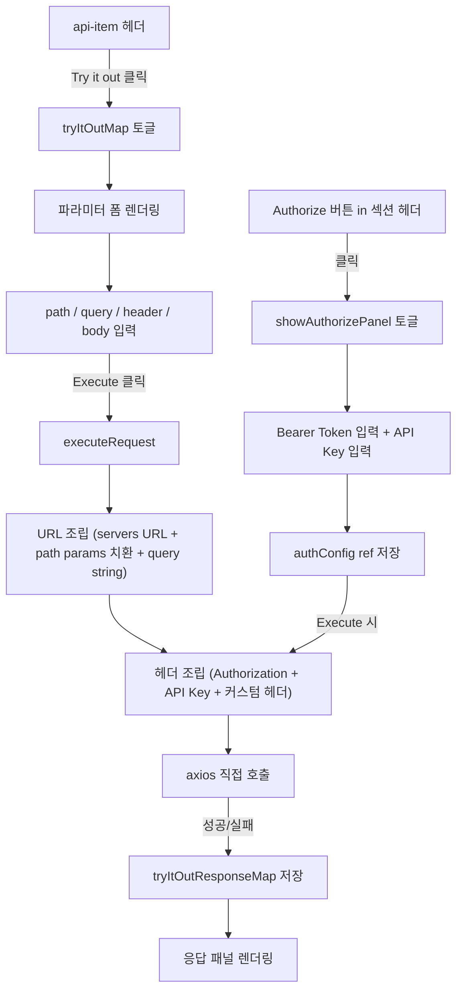

# Try It Out + Authorize 구현 계획

## 변경 파일

- [`src/views/ProjectDetail.vue`](src/views/ProjectDetail.vue) — 전체 구현 (script + template + style)

## 아키텍처 흐름



## 1. Script — 추가할 상태 및 함수

### 상태 (ref)

```typescript
// Authorize 패널
const showAuthorizePanel = ref(false);
const authConfig = ref({
  bearerToken: "",
  apiKey: "",
  apiKeyHeader: "Authorization",
});

// Try it out 활성화 여부 (key: `${tagName}-${index}`)
const tryItOutMap = ref<Record<string, boolean>>({});

// 폼 입력값 (path/query/header params + body)
const tryItOutValues = ref<
  Record<
    string,
    {
      pathParams: Record<string, string>;
      queryParams: Record<string, string>;
      headerParams: Record<string, string>;
      body: string;
    }
  >
>({});

// 실행 결과
const tryItOutResponse = ref<
  Record<
    string,
    {
      status: number;
      statusText: string;
      headers: Record<string, string>;
      body: string;
      loading: boolean;
      error: string | null;
    }
  >
>({});
```

### 핵심 함수

- `getApiBaseUrl()` — `swaggerData.servers[0].url` 우선, 없으면 `project.swaggerUrl`에서 추출
- `initTryItOut(key, endpoint)` — 파라미터 기본값 초기화 (schema의 default/example 사용)
- `toggleTryItOut(key, endpoint)` — tryItOutMap 토글 + initTryItOut 호출
- `executeRequest(key, endpoint)` — URL 조립 → axios 호출 → 결과 저장
  - path params: `endpoint.path.replace(/{(\w+)}/g, ...)` 치환
  - body: `tryItOutValues[key].body` (JSON string)
  - 헤더: `authConfig.bearerToken` → `Authorization: Bearer ...`, `authConfig.apiKey`

### base URL 추출

`swaggerData`는 `apiEndpoints` computed 내부에서만 파싱됩니다. `swaggerBaseUrl`을 별도 computed로 분리해 expose합니다:

```typescript
const swaggerBaseUrl = computed(() => {
  const snap = snapshots.value[0];
  if (!snap) return "";
  try {
    const data = JSON.parse(snap.data);
    return (
      data.servers?.[0]?.url || extractBaseUrl(project.value?.swaggerUrl || "")
    );
  } catch {
    return "";
  }
});
```

## 2. Template 변경

### Authorize 패널 (`.api-list-section` 헤더 오른쪽)

```
[API 목록 헤더]  →  [🔒 Authorize 버튼] [▼ 토글]
[Authorize 패널 (v-if)]
  └─ Bearer Token 입력
  └─ API Key 입력 + API Key Header 입력
  └─ [적용] 버튼
```

### api-item 내부 (`.api-details` 상단)

```
[Try it out] 버튼 (토글)
  ↓ 활성화 시
[Parameters 폼]
  - path 파라미터: text input
  - query 파라미터: text input
  - header 파라미터: text input
[Request Body 폼] (POST/PUT/PATCH)
  - textarea (JSON 편집)
[Execute 버튼] [Cancel 버튼]
  ↓ 실행 후
[응답 패널]
  - Request URL 표시
  - Status code (색상)
  - Response Headers
  - Response Body (code-block + 복사 버튼)
```

## 3. Style 추가

- `.authorize-panel` — 헤더 하단 박스, border + padding
- `.try-it-out-btn` — 우상단 배지형 버튼 (outlined)
- `.try-it-out-form` — 파라미터 폼 영역
- `.param-input` — 인풋 스타일 (dark theme 맞춤)
- `.execute-btn` — 파란색 CTA 버튼
- `.try-it-out-response` — 응답 패널 (status badge + headers + body)
