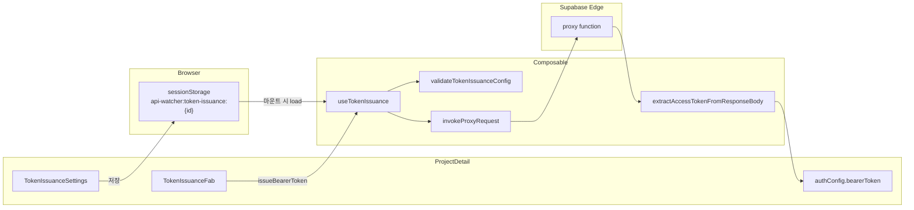

# 토큰 발급 API (token-issuance) 구현 Plan

## 배경·목표

Try it out에서 bearer token이 만료될 때마다 로그인 API Execute → Response Body에서 accessToken 삽입을 반복하는 불편을 해소합니다.

- **발급 API 설정**(method, URL, JSON body, 활성화) → `sessionStorage` (프로젝트 id별)
- **발급된 bearerToken** → 기존 [`authConfig`](src/views/ProjectDetail.vue) 메모리 only (DB/localStorage 저장 없음)
- **동작** → 우측 하단 FAB 클릭 시 proxy 호출 → [`extractAccessTokenFromResponseBody`](src/utils/extract-access-token.ts) → `authConfig.bearerToken` 갱신

## 네이밍·저장 정책

`refresh` 용어는 OAuth refresh token 갱신과 혼동되므로 **전면 `token-issuance`(토큰 발급)** 로 통일합니다.

| 항목              | 값                                       |
| ----------------- | ---------------------------------------- |
| sessionStorage 키 | `api-watcher:token-issuance:{projectId}` |
| 타입              | `TokenIssuanceConfig`                    |
| 핵심 함수         | `issueBearerToken()` (not refresh)       |
| FAB 조건          | `canShowIssuanceFab`                     |

```typescript
interface TokenIssuanceConfig {
  enabled: boolean;
  method: string; // get | post | put | patch | delete
  url: string;
  body: string; // POST/PUT/PATCH 시 JSON 문자열
}
```

- 탭 닫으면 설정 삭제 (민감 payload가 서버 DB에 남지 않음)
- [`Project`](src/types/project.ts), [`project-store`](src/stores/project-store.ts), `schema.sql` **변경 없음**

## 아키텍처



## Phase 0 — 타입·검증·sessionStorage

### 신규 파일

1. [`src/types/token-issuance.ts`](src/types/token-issuance.ts)
   - `TokenIssuanceConfig` interface
   - `createDefaultTokenIssuanceConfig()` — `{ enabled: false, method: 'post', url: '', body: '' }`

2. [`src/utils/validate-token-issuance-config.ts`](src/utils/validate-token-issuance-config.ts)
   - `validateTokenIssuanceConfig(config)` → `{ isValid: boolean, errors: string[] }`
   - 규칙:
     - `enabled`가 false면 검증 스킵 (FAB 숨김용)
     - method: 허용 목록 (`proxy`와 동일: get/post/put/patch/delete)
     - url: `http`/`https` 파싱 성공
     - body: POST/PUT/PATCH 시 비어있지 않고 유효 JSON; GET/DELETE 시 무시

3. [`src/utils/token-issuance-storage.ts`](src/utils/token-issuance-storage.ts)
   - `getStorageKey(projectId)` → `api-watcher:token-issuance:{projectId}`
   - `loadTokenIssuanceConfig(projectId): TokenIssuanceConfig | null`
   - `saveTokenIssuanceConfig(projectId, config): void`
   - `removeTokenIssuanceConfig(projectId): void`
   - JSON 파싱 실패·필드 누락 시 `null` 또는 default 반환

### 테스트

- [`src/utils/__tests__/validate-token-issuance-config.test.ts`](src/utils/__tests__/validate-token-issuance-config.test.ts)
- [`src/utils/__tests__/token-issuance-storage.test.ts`](src/utils/__tests__/token-issuance-storage.test.ts)
- [`src/test/setup.ts`](src/test/setup.ts)에 `sessionStorage` mock 추가 (기존 localStorage mock 패턴 재사용)

**DoD:** 프로젝트 id 기준 save/load/remove 단위 테스트 통과

---

## Phase 1 — proxy 공통화·발급 로직

### 신규 파일

1. [`src/utils/invoke-proxy-request.ts`](src/utils/invoke-proxy-request.ts)
   - 기존 [`executeRequest`](src/views/ProjectDetail.vue) 내 proxy 호출부 추출:

```typescript
// 현재 패턴 (L1263-1265)
await supabase.functions.invoke("proxy", {
  body: { method, url, headers, body: bodyData },
});
```

- `invokeProxyRequest({ method, url, headers?, body? })` 반환: `{ status, statusText, headers, body: string }`
- non-2xx·invoke error 시 명확한 `Error` throw
- response body는 Try it out와 동일하게 stringified JSON으로 정규화

2. [`src/composables/use-token-issuance.ts`](src/composables/use-token-issuance.ts) — 프로젝트 **첫 composable**

```typescript
function useTokenIssuance(
  projectId: Ref<string> | string,
  authConfig: Ref<{ bearerToken: string; ... }>
)
```

- `draft: Ref<TokenIssuanceConfig>` — 폼 바인딩용
- `savedConfig: Ref<TokenIssuanceConfig | null>` — sessionStorage에 저장된 스냅샷
- `validationErrors: ComputedRef<string[]>`
- `canShowIssuanceFab: ComputedRef<boolean>` — `savedConfig.enabled && validate(savedConfig).isValid`
- `isIssuing: Ref<boolean>`
- `loadFromStorage()` — `projectId` 변경·마운트 시 호출
- `saveSettings()` — draft 검증 → sessionStorage save → `savedConfig` 갱신
- `issueBearerToken()` — `savedConfig` 기준 proxy 호출 → token 추출 → `authConfig.bearerToken` 설정; 실패 시 에러 메시지 반환

- 발급 요청 headers: `{ 'Content-Type': 'application/json' }` (body가 JSON일 때)
- 성공 시 Authorize 패널 **자동 미오픈** (기존 `insertAccessTokenFromResponse`는 패널을 연다 — FAB 경로는 토스트만)

### 선택적 리팩터

- [`ProjectDetail.vue`](src/views/ProjectDetail.vue) `executeRequest`가 `invokeProxyRequest`를 사용하도록 변경 (중복 제거, 동작 동일 유지)

### 테스트

- [`src/composables/__tests__/use-token-issuance.test.ts`](src/composables/__tests__/use-token-issuance.test.ts)
  - `invokeProxyRequest`, `extractAccessTokenFromResponseBody` mock
  - save → FAB 조건, issue 성공/실패/토큰 없음 케이스

**DoD:** mock 기반 발급 플로우 단위 테스트 통과

---

## Phase 2 — UI·ProjectDetail 통합

### 신규 컴포넌트

1. [`src/components/TokenIssuanceSettings.vue`](src/components/TokenIssuanceSettings.vue)
   - 배치: [`info-section`](src/views/ProjectDetail.vue) 내 `info-grid` 아래
   - UI:
     - 섹션 제목: **토큰 발급 API**
     - 활성화 토글 (`draft.enabled`)
     - Method select, URL input, Body textarea (JSON)
     - 안내: proxy는 **공개 URL만** 가능; 설정은 **탭 종료 시 삭제**
     - **저장** 버튼 → `saveSettings()`; validation 실패 시 인라인 에러
   - 스타일: [`ProjectFormModal.vue`](src/components/ProjectFormModal.vue)의 `form-group` / `help-text` 패턴 + [`info-section`](src/views/ProjectDetail.vue) SCSS 변수 재사용

2. [`src/components/TokenIssuanceFab.vue`](src/components/TokenIssuanceFab.vue)
   - `Teleport to="body"`, `position: fixed`, 우측 하단
   - props: `visible`, `loading`, `disabled`
   - emit: `issue`
   - 라벨: **토큰 발급** (또는 아이콘 + tooltip)
   - `canShowIssuanceFab`가 false면 미렌더

### ProjectDetail 수정

[`src/views/ProjectDetail.vue`](src/views/ProjectDetail.vue):

```vue
<!-- info-section 내부, info-grid 다음 -->
<TokenIssuanceSettings
  v-model:draft="issuance.draft"
  :errors="issuance.validationErrors"
  @save="issuance.saveSettings"
/>

<!-- template 하단, 기존 copy-toast Teleport 근처 -->
<TokenIssuanceFab
  v-if="issuance.canShowIssuanceFab"
  :loading="issuance.isIssuing"
  @issue="handleIssueBearerToken"
/>
```

- `const issuance = useTokenIssuance(projectId, authConfig)`
- `onMounted` / `watch(projectId)`에서 `issuance.loadFromStorage()`
- `handleIssueBearerToken`: `issueBearerToken()` 결과에 따라 기존 `showToast` 재사용
  - 성공: "Bearer token이 발급되었습니다"
  - 실패: proxy/추출 에러 메시지

**DoD:** 설정 저장 → FAB 표시 → 발급 → Try it out Authorization 헤더에 반영

---

## 범위 밖 (MVP 제외)

- DB migration / `Project` 타입 확장
- bearerToken 영속화
- 자동 만료 감지·주기적 발급
- 발급 API 커스텀 헤더
- 별도 OAuth refresh token 갱신 API (향후 `token-refresh` 도메인으로 분리)

## 검증 체크리스트

- [ ] 설정 저장 후 **같은 탭** 새로고침 시 설정 유지
- [ ] **탭 닫기** 후 재접속 시 설정 없음
- [ ] 활성화 OFF → FAB 숨김, 기존 bearerToken 유지
- [ ] FAB 발급 성공 → `authConfig.bearerToken` 반영, Try it out `Authorization` 헤더 확인
- [ ] 내부망 URL 시 proxy 실패 메시지 표시
- [ ] `npm run test` · `npm run build` 통과

## 변경 파일 요약

| 구분      | 경로                                                                                                                                                                                                                                                                                             |
| --------- | ------------------------------------------------------------------------------------------------------------------------------------------------------------------------------------------------------------------------------------------------------------------------------------------------ |
| 신규      | `src/types/token-issuance.ts`, `src/utils/validate-token-issuance-config.ts`, `src/utils/token-issuance-storage.ts`, `src/utils/invoke-proxy-request.ts`, `src/composables/use-token-issuance.ts`, `src/components/TokenIssuanceSettings.vue`, `src/components/TokenIssuanceFab.vue`, 테스트 3개 |
| 수정      | `src/views/ProjectDetail.vue`, `src/test/setup.ts`                                                                                                                                                                                                                                               |
| 변경 없음 | `supabase/functions/proxy`, `src/utils/extract-access-token.ts`, DB/schema/store                                                                                                                                                                                                                 |
