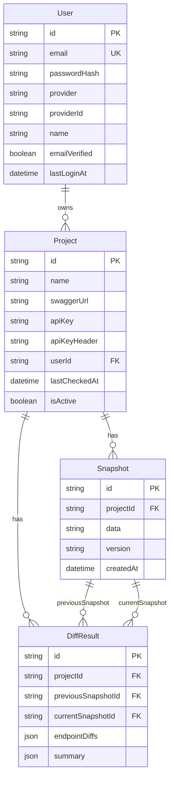
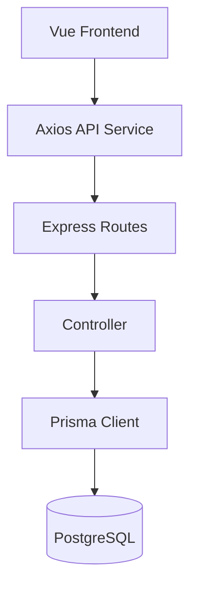
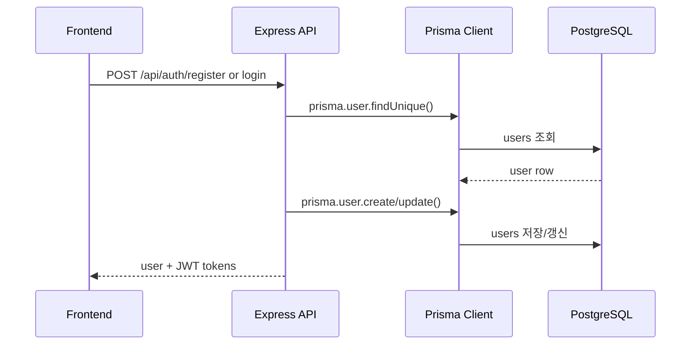
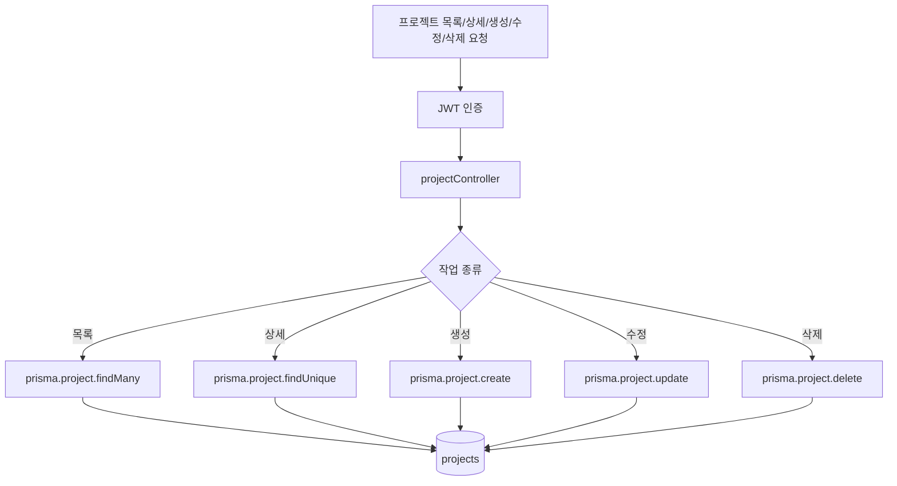
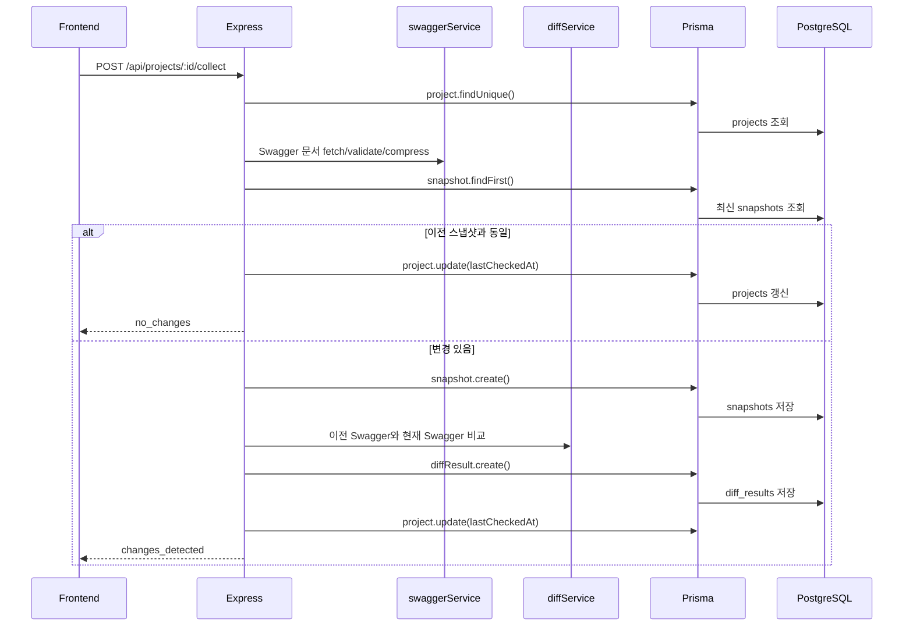

현재 프로젝트에서 `Prisma + PostgreSQL`은 **백엔드 영속 저장소 계층**입니다. 프론트엔드는 직접 PostgreSQL에 접근하지 않고, `Axios -> Express API -> Prisma Client -> PostgreSQL` 순서로 접근합니다.

**사용 위치**
- Prisma 스키마/DB 연결 정의: [schema.prisma](/Users/jeonbongcheol/Desktop/proj/api-watcher/server/prisma/schema.prisma:8)
  - `provider = "postgresql"`
  - `url = env("DATABASE_URL")`
- Prisma Client 생성: [client.ts](/Users/jeonbongcheol/Desktop/proj/api-watcher/server/src/prisma/client.ts:1)
- Prisma 명령어: [server/package.json](/Users/jeonbongcheol/Desktop/proj/api-watcher/server/package.json:9)
  - `npm run prisma:generate`
  - `npm run prisma:migrate`
  - `npm run prisma:studio`
- 마이그레이션 파일:
  - `server/prisma/migrations/20260120070314_/migration.sql`
  - `server/prisma/migrations/20260202091053_/migration.sql`
  - `server/prisma/migrations/20260202181919_add_social_login_fields/migration.sql`

**DB 모델 구조**

**주요 워크플로우**

**인증 흐름**

관련 코드:
- 회원가입: [authController.ts](/Users/jeonbongcheol/Desktop/proj/api-watcher/server/src/controllers/authController.ts:14)
- 로그인: [authController.ts](/Users/jeonbongcheol/Desktop/proj/api-watcher/server/src/controllers/authController.ts:70)
- 소셜 로그인 사용자 생성/갱신: [passport-strategies.ts](/Users/jeonbongcheol/Desktop/proj/api-watcher/server/src/services/passport-strategies.ts:18)

**프로젝트 CRUD 흐름**

관련 코드:
- 목록: [projectController.ts](/Users/jeonbongcheol/Desktop/proj/api-watcher/server/src/controllers/projectController.ts:8)
- 생성: [projectController.ts](/Users/jeonbongcheol/Desktop/proj/api-watcher/server/src/controllers/projectController.ts:79)
- 수정/삭제 전 소유자 확인: [projectController.ts](/Users/jeonbongcheol/Desktop/proj/api-watcher/server/src/controllers/projectController.ts:112)

**Swagger 수집/비교 저장 흐름**

핵심 구현은 [projectController.ts](/Users/jeonbongcheol/Desktop/proj/api-watcher/server/src/controllers/projectController.ts:204)입니다. 여기서:
- 프로젝트 소유자 확인
- Swagger 문서 가져오기
- 압축된 Swagger 문자열 생성
- 최신 스냅샷과 비교
- 변경 없으면 `Project.lastCheckedAt`만 갱신
- 변경 있으면 `Snapshot` 생성
- 이전 스냅샷이 있으면 `DiffResult` 생성

**조회 흐름**
- 스냅샷 목록/단건 조회: [snapshotController.ts](/Users/jeonbongcheol/Desktop/proj/api-watcher/server/src/controllers/snapshotController.ts:6)
- Diff 목록/단건 조회: [diffController.ts](/Users/jeonbongcheol/Desktop/proj/api-watcher/server/src/controllers/diffController.ts:6)

**정리**
이 프로젝트의 PostgreSQL은 `users`, `projects`, `snapshots`, `diff_results`를 저장합니다. Prisma는 이 테이블들을 TypeScript 코드에서 `prisma.user`, `prisma.project`, `prisma.snapshot`, `prisma.diffResult` 형태로 다루게 해주는 ORM입니다. 실제 DB 접근은 전부 `server/src/controllers/*`와 `server/src/services/passport-strategies.ts`에 모여 있고, 프론트엔드는 백엔드 API를 통해서만 이 데이터에 접근합니다.